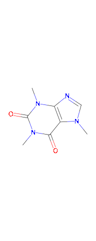
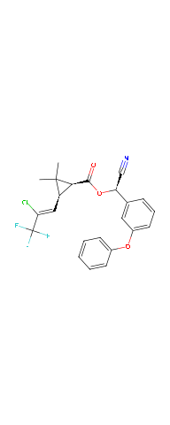

<!-- README.md is generated from README.rmd. Please edit that file -->

# chents

[](https://pkgdown.jrwb.de/chents/)
[](https://jranke.r-universe.dev/chents)
[](https://pkgdown.jrwb.de/chents/coverage/coverage.html)

The R package **chents** provides some utilities for working with
chemical entities in R.

When first defining a chemical entity, some chemical information is
retrieved from the [PubChem](https://pubchem.ncbi.nlm.nih.gov/) website
using the [webchem](https://docs.ropensci.org/webchem/) package.

``` r
library(chents)
caffeine <- chent$new("caffeine")
#> Querying PubChem ...
#> Trying to get chemical information from RDKit using PubChem SMILES
#> CN1C=NC2=C1C(=O)N(C(=O)N2C)C
```

If Python and [RDKit](https://rdkit.org) (\> 2015.03) are installed and
configured for use with the
[reticulate](https://rstudio.github.io/reticulate/) package, some
additional chemical information including a 2D graph are computed.

The print method gives an overview of the information that was
collected.

``` r
print(caffeine)
#> <chent>
#> Identifier $identifier caffeine 
#> InChI Key $inchikey RYYVLZVUVIJVGH-UHFFFAOYSA-N 
#> SMILES string $smiles:
#>                        PubChem 
#> "CN1C=NC2=C1C(=O)N(C(=O)N2C)C" 
#> Molecular weight $mw: 194.2 
#> PubChem synonyms (up to 10):
#>  [1] "caffeine"                "58-08-2"                
#>  [3] "Guaranine"               "1,3,7-Trimethylxanthine"
#>  [5] "Methyltheobromine"       "Theine"                 
#>  [7] "Thein"                   "Cafeina"                
#>  [9] "Koffein"                 "Mateina"
```

There is a very simple plotting method for the chemical structure.

``` r
plot(caffeine)
```

<!-- -->

Additional information can be (but is rarely ever) read from a local
.yaml file. This information can be leveraged e.g. by the
[PEC_soil](https://pkgdown.jrwb.de/pfm/reference/PEC_soil.html) function
of the ‘pfm’ package.

If you have a so-called ISO common name of a pesticide active
ingredient, you can use the ‘pai’ class derived from the ‘chent’ class,
which starts with querying the [BCPC
compendium](http://www.bcpcpesticidecompendium.org/) first.

``` r
lambda <- pai$new("lambda-cyhalothrin")
#> Querying BCPC for lambda-cyhalothrin ...
#> Querying PubChem ...
#> Trying to get chemical information from RDKit using PubChem SMILES
#> CC1([C@@H]([C@@H]1C(=O)O[C@@H](C#N)C2=CC(=CC=C2)OC3=CC=CC=C3)/C=C(/C(F)(F)F)\Cl)C
#> RDKit mw is 449.856
#> mw is 449.8
plot(lambda)
```

<!-- -->

## Installation

You can conveniently install chents from the repository kindly made
available by the R-Universe project:

    install.packages("chents",
      repos = c("https://jranke.r-universe.dev", "https://cran.r-project.org"))

In order to profit from the chemoinformatics, you need to install RDKit
and its python bindings. On a Debian type Linux distribution, just use

    sudo apt install python3-rdkit

If you use this package on Windows or MacOS, I would be happy to include
installation instructions here if you share them with me, e.g. via a
Pull Request.

## Configuration of the Python version to use

On Debian type Linux distributions, you can use the following line in
your global or project specific `.Rprofile` file to tell the
`reticulate` package to use the system Python version that will find the
RDKit installed in the system location.

    Sys.setenv(RETICULATE_PYTHON="/usr/bin/python3")
